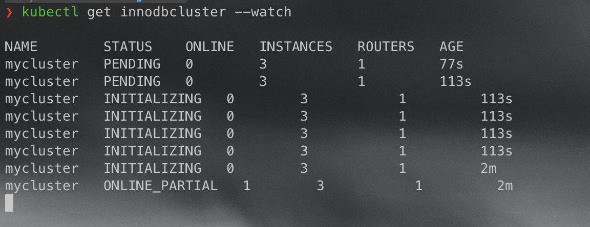
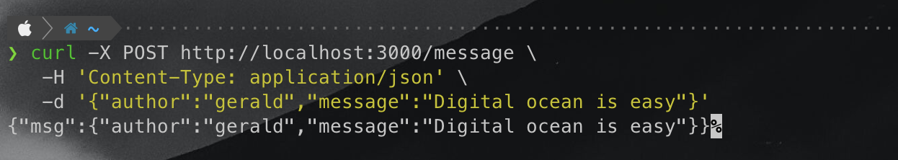
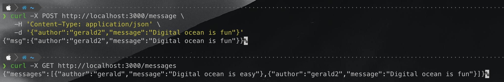
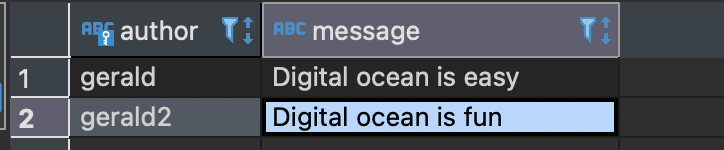

# DigitalOcean-Kubernetes-Challenge

Deploying a Scalable MySQL DB in a Kubernetes cluster fully managed by Digital Ocean.

1. Create a Kubernetes cluster on Digital Ocean: https://cloud.digitalocean.com/kubernetes/clusters

2. Follow instructions available on Digital Ocean's Getting Started to quickly authenticate and connect to your newly provisioned cluster.

3. I decided to use the [Oracle's msql operator](https://github.com/mysql/mysql-operator) to simplify the process. 
> The MySQL Operator is, at it’s core, a simple Kubernetes controller that watches the API server for Customer Resource Definitions relating to MySQL and acts on them.

### Install MySQL operator using kubectl
```
kubectl apply -f https://raw.githubusercontent.com/mysql/mysql-operator/trunk/deploy/deploy-crds.yaml
```
```
kubectl apply -f https://raw.githubusercontent.com/mysql/mysql-operator/trunk/deploy/deploy-operator.yaml
```

### Create the secrets used later to connect to the DB.
The below command sets the password for the root user to be password123

```
kubectl create secret generic mypwds \
        --from-literal=rootUser=root \
        --from-literal=rootHost=% \
        --from-literal=rootPassword="password123"

```

### Deploy our MySQL cluster
The sample cluster provided by Oracle creates 3 MySQL instances and one MySQL router instance.

```
kubectl apply -f https://raw.githubusercontent.com/mysql/mysql-operator/trunk/samples/sample-cluster.yaml
```

We can observe the process by running the command below. The entire process might take a few minutes.

```
kubectl get innodbcluster --watch
```



To get more info on the deployed cluster, run

```
kubectl describe service mycluster
```

Lastly, we can perform a port forwarding operation to expose the instance so we can connect to the application from outside the cluster.

```
kubectl port-forward service/mycluster mysql
```


### Connect to the MySQL instance

Connect to the MySQL instance using your application/Db Client. From above, my db is running on port 6446. A sample command to connect to it using mysql shell is given below. Enter your password when prompted.

```
mysqlsh -h127.0.0.1 -P6446 -u root -p
```

As a quick example, I have a simple web application to store messages in the DB using simple post requests to save a message into the DB. Note: the connection details are hardcoded to my MySQL cluster, you might have to change it depending on your cluster settings.

Adding a record to the table:


Getting the records from the table:


Records saved in table:
